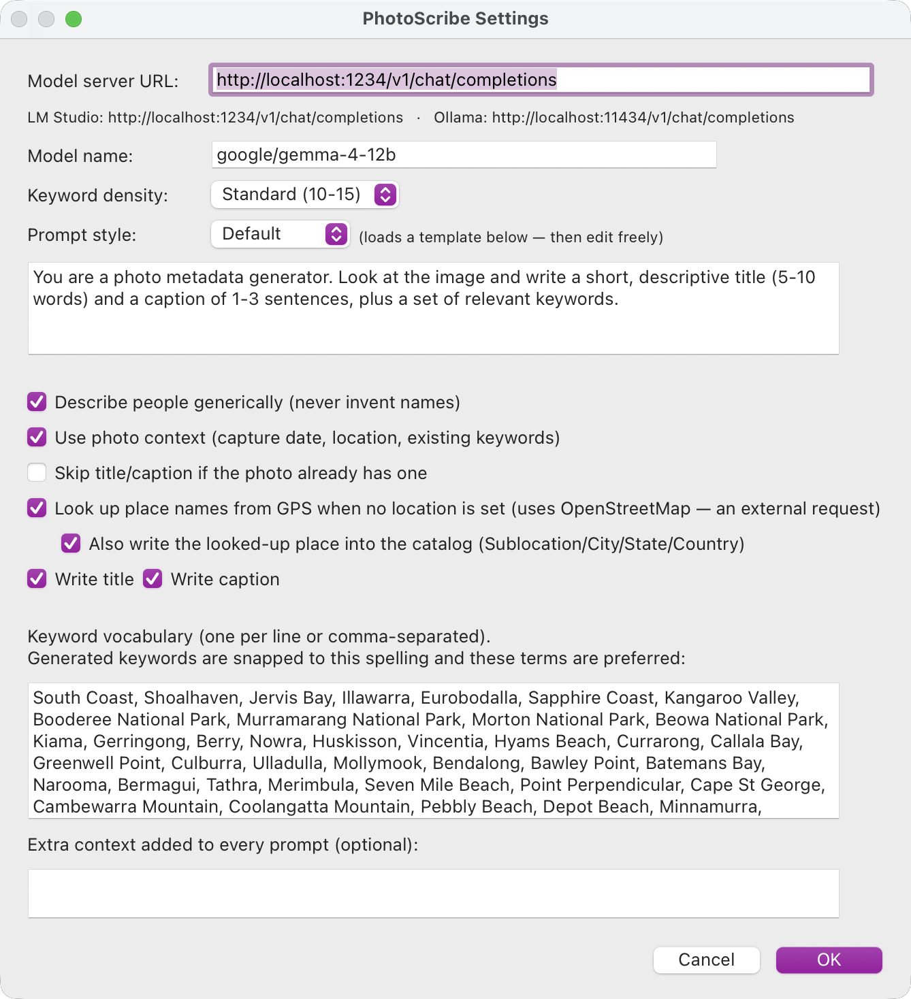

# PhotoScribe for Lightroom Classic

A Lightroom Classic plugin that generates a **title, caption, and keywords**
for your selected photos using a **local** AI model (LM Studio or Ollama) and
writes them straight into the catalog — no cloud, no subscription, no
export/import round-trip. Your photos never leave your machine.

Companion to the standalone [PhotoScribe](https://github.com/repomonkey/PhotoScribe)
desktop app; it shares the same local-model approach and the structured-output
schema that keeps the model's replies clean.

## What it does

For each selected photo:

1. Gets a downsized JPEG from Lightroom's own render.
2. Builds a prompt from your settings and the photo's own context (capture
   date, location, existing keywords, named people), then asks the local model
   for structured JSON (`{title, caption, keywords}`).
3. Snaps keywords to your vocabulary and writes `title`, `caption`, and
   `keywords` into the catalog.

## Requirements

- Lightroom Classic 6 or newer.
- A local model server running, with a **vision** model loaded:
  - **LM Studio** — OpenAI-compatible server on `http://localhost:1234`
    (the default). Load a vision model, e.g. `google/gemma-4-12b`.
  - **Ollama** — set `ENDPOINT` to `http://localhost:11434/v1/chat/completions`.

## Install

1. In Lightroom Classic: **File → Plug-in Manager… → Add**.
2. Select this `PhotoScribe.lrdevplugin` folder.
3. It appears in the list as **PhotoScribe**.

## Use

1. Select one or more photos in the Library.
2. **Library → Plug-in Extras → Generate Metadata with PhotoScribe**
   (also in the right-click **Plug-in Extras** submenu).
3. Watch the progress bar; a summary dialog reports how many were written.

## Settings

**Plug-in Extras → PhotoScribe Settings…** — no need to edit code:

- **Model server URL** — LM Studio (`:1234`) or Ollama (`:11434`) OpenAI endpoint.
- **Model name** — e.g. `google/gemma-4-12b`.
- **Keyword density** — Fewer / Standard / More.
- **Prompt style** — Default / Landscape / Event / Product presets. Picking one
  loads its template into an editable prompt box, which you can then tweak.
- **Describe people** — describes people's roles/actions generically, and if a
  photo has named faces (Lightroom's People feature), uses those actual names
  in the title and caption. Never invents names.
- **Use photo context** — feeds the capture date, location, and existing
  keywords into the prompt (so it can build on tags you already have).
- **Look up place names from GPS** — when a photo has GPS but no location
  fields, reverse-geocodes via OpenStreetMap (Nominatim) so the caption can
  name the place. Opt-in (an external request); only fires when there's GPS
  and no location already set. Optionally writes the result back into the
  catalog's Sublocation/City/State/Country fields.
- **Skip title/caption if already present** — protect existing values.
- **Write title / Write caption** — toggle each.
- **Keyword vocabulary** — your preferred keyword list. Generated keywords are
  snapped to this spelling and these terms are preferred, which reins in the
  model's tendency to invent odd taxonomy terms.
- **Extra context** — freeform text added to every prompt.

Settings persist between sessions.

## Status — what's verified vs not

Validated outside Lightroom (via the Lua interpreter + the live model):

- ✅ The JSON decoder (`json.lua`) — objects, arrays, escapes, UTF-8.
- ✅ The base64 encoder — against RFC 4648 test vectors.
- ✅ The **full request/response round-trip** against LM Studio + Gemma-4-12B:
  the exact payload this plugin builds is accepted, structured output returns
  clean JSON, and our decoder extracts title/caption/keywords correctly.

Needs Lightroom itself to exercise:

- ⏳ `photo:requestJpegThumbnail` to get the image bytes (replaced an earlier
  `LrExportSession` approach, which hit the SDK's "must not call on main UI
  task" rule for renditions).
- ⏳ Writing `title` / `caption` / `keywords` into the catalog
  (`setRawMetadata`, `createKeyword`, `addKeyword`).

## Follow-ups

- Verify the Ollama endpoint end-to-end (only LM Studio's OpenAI shape is
  confirmed so far; the call is OpenAI-compatible so it should work).
- Package as a `.lrplugin` / Adobe Exchange listing.
- Optional: append-vs-replace keyword modes; per-run overrides.

## Layout

- `Info.lua` — plugin manifest + menu items.
- `GenerateMetadata.lua` — the action (render → model → write).
- `PhotoScribeSettings.lua` — the Settings dialog.
- `PhotoScribeCore.lua` — pure-Lua prompt assembly + keyword snapping (unit-tested).
- `PhotoScribePrefs.lua` — persisted preferences.
- `json.lua` — dependency-free JSON decoder (Lua 5.1 compatible).
